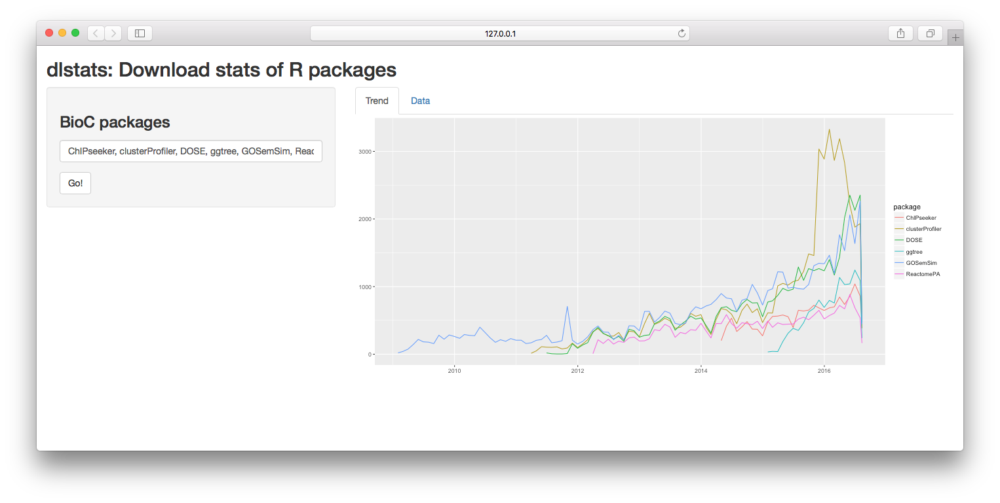
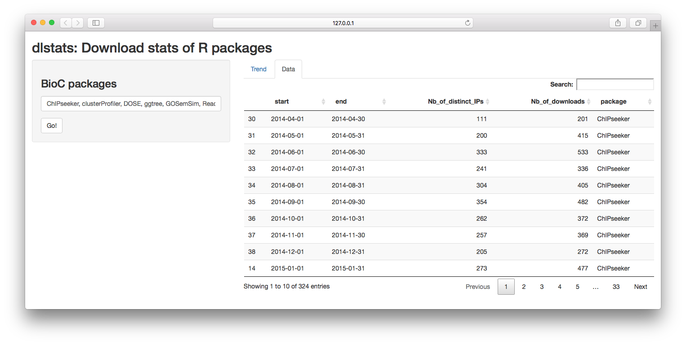

```{r style, echo=FALSE, results="asis", message=FALSE}
knitr::opts_chunk$set(tidy = FALSE,
		   message = FALSE)
```


```{r echo=FALSE, results="hide", message=FALSE}
library("tidyr")
library("ggplot2")
library("dlstats")
```

# Introduction

This `R` package queries download stats of `R` packages.

+ For [CRAN](https://cran.r-project.org/) packages, it queries from RStudio download logs.

+ For [Bioconductor](https://bioconductor.org/) packages, it queries from [Bioconductor download stats](https://bioconductor.org/packages/stats/).


# Download stats of CRAN packages

```{r fig.width=10}
library("ggplot2")
library("dlstats")

x <- cran_stats(c("emojifont", "ggimage", "hexSticker", "rvcheck"))

if (!is.null(x)) {
   head(x)
   ggplot(x, aes(end, downloads, group=package, color=package)) +
       geom_line() + geom_point(aes(shape=package))
}
```


# Download stats of Bioconductor packages

```{r fig.width=10}
pkgs <- c("ChIPseeker", "clusterProfiler", "DOSE", "ggtree", "GOSemSim", "ReactomePA")
y <- bioc_stats(pkgs)

if (!is.null(y)) {
   head(y)
   ggplot(y, aes(end, Nb_of_downloads, group=package, color=package)) +
       geom_line() + geom_point(aes(shape=package))

   library("tidyr")
   yy <- gather(y, type, Nb, Nb_of_distinct_IPs:Nb_of_downloads)

   ggplot(yy, aes(end, Nb, shape=package, color=package)) +geom_point() + geom_line() +
       ylab(NULL) + xlab(NULL) + facet_grid(type~., scales="free_y") +
       ggtitle("Number of downloads per Month") +
       scale_x_date(date_breaks="1 year", date_labels = "%Y")
}
```


# Shiny apps

We also provide shiny app for visualizing download stats of R packages.

User can use `cranApp()` or `biocApp()` for `CRAN` packages and `Bioconductor` packages respectively.

```r
biocApp()
```





